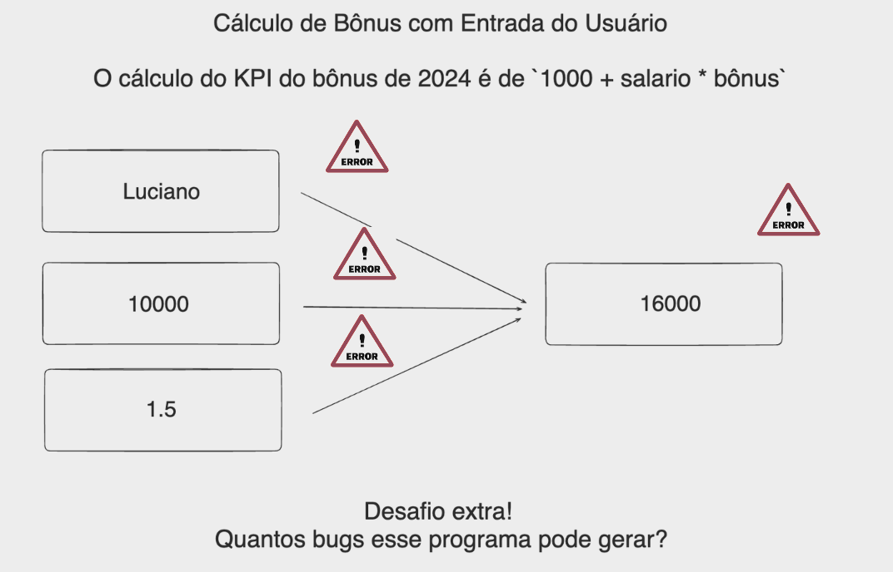

### Desafio - Refatorar o projeto da aula anterior evitando Bugs!

Para resolver os bugs identificados — tratamento de entradas inválidas que não podem ser convertidas para um número de ponto flutuante e prevenção de valores negativos para salário e bônus, você pode modificar o código diretamente. Isso envolve adicionar verificações adicionais após a tentativa de conversão para garantir que os valores sejam positivos.

