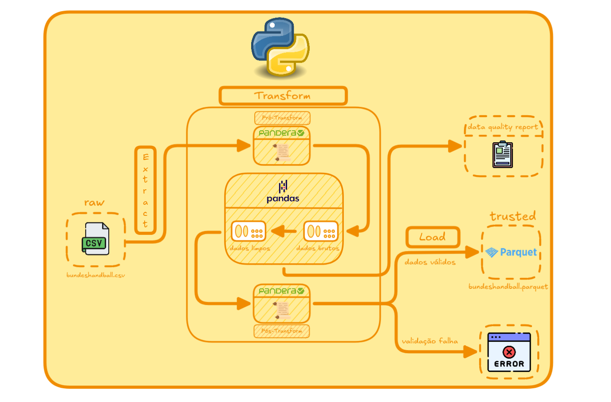

<h2 align="center">🤾 Handball With Data Engineering </h2>

<p align="center">
  
  
  
  
</p>

Um pipeline que lê dados brutos a partir de um arquivo CSV, limpa as suas inconsistências, valida sua estrutura antes e depois da limpeza, devolve os dados limpos e confiáveis em parquet, visando o uso dos dados para futuras análises.

## 🎯 Por que este projeto existe?

No cotidiano, os dados nunca chegam totalmente limpos. Times de dados recebem os dados com sujeira, duplicatas, valores fora do intervalo esperado, formatos inconsistentes e valores faltantes. O engenheiro de dados entra nesta parte, para construir processos que devem garantir que os dados estejam confiáveis antes de chegarem à etapa de análises estratégicas, para que os dados sejam úteis na tomada de decisões de negócio, algo que pode ser comprometido se os dados não forem confiáveis. Por isso, peguei dados originalmente limpos, sujei de propósito, e construí um pipeline com estrutura de ETL + contrato de dados, visando manter a qualidade dos dados a cada etapa e documentar/justificar cada decisão de limpeza.

## 🗺️ Visão Geral

1. Extração/Leitura dos dados presentes em um arquivo CSV, utilizando pandas.
2. Comparação dos dados brutos vs contrato de dados (Pré-Transform com Pandera).
3. Transformação modular de inconsistências com Pandas. (Funções de limpeza dedicadas uma por tipo de inconsistência)
4. Validação de regras de negócio e schema pós-limpeza, sendo como um portão de qualidade. (Pós-Transform com Pandera)
5. Carregamento dos dados limpos e confiáveis em `.parquet`, utilizando **PyArrow** como engine.

## ℹ️ Sobre o Pipeline


O projeto **Handball With Data Engineering** simula na prática o fluxo de trabalho de um pipeline de dados real. A estrutura segue um modelo de **"ETL" (Extract, Transform, Load)** , extraindo os dados brutos de um arquivo CSV, limpando suas inconsistências através de transformações, e os dados limpos sendo carregados em um formato otimizado para análise.

Antes de qualquer transformação, o pipeline compara os dados que chegam contra um **"contrato de dados"**, chamado dentro do pipeline de etapa **Pré-Transform**. Após toda a limpeza de inconsistências, os dados são comparados com um segundo **"contrato de dados"** com verificações mais exigentes e regras de negócio, chamado dentro do pipeline de etapa **Pós-Transform**. Estas etapas são adicionadas ao projeto com o objetivo de evitar que os dados inconsistentes avancem silenciosamente.
- **Pré-Transform:** Definição de quais colunas são esperadas, tipo de dados que cada uma deve ter.
- **Pós-Transform:** Base do contrato anterior, mas adicionado regras mais exigentes como os valores que são permitidos em tal coluna, se uma coluna feita por cálculo possui os valores corretos. Caso os dados não estiverem de acordo, esta etapa para a execução do pipeline.

No fim da etapa de limpeza, é gerado o **Data Quality Report**, documentando as inconsistências encontradas, a decisão para lidar com elas e o porquê. Já as etapas Pré-Transform e Pós-Transform, em caso de divergência com o contrato de dados, geram um **relatório de erro de validação** próprio, apontando exatamente qual verificação falhou.


### 🔁 Fluxo do Pipeline


---

## ⚙️ Etapas do Pipeline

### 📥 Extract

A etapa de extração/leitura do pipeline é dividida em duas responsabilidades: uma função para encontrar o arquivo CSV (`encontrar_caminho_dados_csv`) e outra realiza a leitura dos dados. Essa separação ocorre com o objetivo de cada função ter responsabilidade única, visando que caso houvesse alterações no armazenamento dos dados no futuro, a etapa não precisasse ser totalmente modificada e sim a função que possui a responsabilidade de encontrar o arquivo.


O tratamento de erros se diferencia em dois tipos de situação: 
- Problemas que são imprevisíveis (fora do controle do código), como remoção do arquivo, localização alterada durante o pipeline, ou até mesmo, arquivo sem permissão para ser lido. 
- Problemas que podem ser encontrados com os dados que o código já possui, como confirmar se o caminho é inexistente, se o arquivo possui dados, assim por diante.

Para o primeiro cenário, foi decidido que o pipeline iria utilizar `try-except`, capturando o erro sem interromper a execução de forma brusca. Para o segundo, a utilização de `if-else`, já que é uma verificação previsível, que em caso de falha, aciona um tratamento mais brusco com `raise` gerando uma quebra do fluxo.
O tratamento de erros também segue o princípio de responsabilidade única. Por exemplo, a função (`encontrar_caminho_dados_csv`) somente lida com situações que envolvem **Path**. 

### 🧹 Transform

A limpeza dos dados possui uma arquitetura modular: cada tipo de inconsistência (como valores nulos, caracteres especiais desnecessários, duplicatas, entre outros) é tratada por uma função dedicada, responsável apenas por aquele erro específico. Cada função recebe o DataFrame, aplica a limpeza, e devolve tanto o DataFrame quanto um relatório em formato dict que documenta informações da inconsistência tratada, o que foi encontrado e a decisão tomada. Este dicionário é o que alimenta o Data Quality Report gerado após toda a etapa de limpeza ser executada.

Todas as funções de limpeza são conectadas em uma função orquestradora que executa as correções de forma sequencial nos dados recebidos, antes de os dados seguirem para a etapa de **Pós-Transform**.

### 📦 Load

Após os dados serem validados pela etapa anterior **(Pós-Transform)**, a etapa de Load recebe os dados, e o resultado é carregado para `.parquet`, visando melhor desempenho dos dados em futuras análises, tendo como engine o **PyArrow** e utilizando o método de compresão **Snappy** (Principal método por priorizar eficiência e performance). Uma boa observação é que a etapa de Load não valida se os dados estão corretos ou não, e sim a etapa anterior, mantendo em consideração a estrutura do projeto onde cada etapa tem sua responsabilidade única e contribui individualmente para o pipeline.

---

## 📜 Estratégia de Data Quality

A qualidade de dados é aplicada em três etapas do pipeline, cada uma capturando um tipo de inconsistência diferente:

| Etapa | O que verifica | Ferramenta | Se encontrar, executa
|---|---|---|---|
| **Pré-Transform** | Verifica inconsistências de schema, tipo dos dados da coluna, colunas necessárias  | ***Pandera*** | Gera relatório `.json` com informações sobre os erros encontrados. (Esperado para se ter um diagnóstico antes da limpeza) |
| **Transform** | Verifica inconsistências dentro dos dados sujos, como nulos, duplicatas, entre outros | ***Pandas*** | Aplica funções de limpeza e gera um relatório final `.json` com informações sobre as inconsistências. (O que foi encontrado, decidido, etc) |
| **Pós-Transform** | Verificações mais exigentes como: regras de negócio, valores impossíveis ou fora do intervalo aceitável, se valores calculados batem com o esperado, inconsistências de schema | ***Pandera*** | Quebra o fluxo do pipeline e gera um relatório `.json` com informações sobre os erros encontrados |

---

## 🛠️ Tecnologias e Stack

| Ferramenta | Versão | Funcionalidade |
|---|---|---|
| **Python** | 3.11.5 | Linguagem Principal de Programação
| **Pandas** | 3.0.3 | Leitura, manipulação para limpeza dos dados e carregamento em .parquet.
| **Pandera** | 0.32.0 | Contrato de Dados (Validação Schema)
| **PyArrow** | 24.0.0 | Engine para salvar arquivo em `.parquet`

---

## 🏗 Estrutura do Projeto

```
└── handball-with-data-engineering
  ├── assets/img/
  | └── pipeline_diagram.png    # Diagrama visual do fluxo do pipeline (Excalidraw).
  |
  ├── data/
  | ├── raw/
  | | └── bundeshandball.csv    # Dataset bruto, sujo com inconsistências.
  | |
  | ├── reports/data_quality_reports/
  | | ├── pre_transform_data_quality_report.json  # Gerado quando há divergência entre o contrato de dados e os dados brutos. (comportamento esperado, funciona como diagnóstico antes da limpeza)
  | | ├── pos_transform_data_quality_report.json  # Gerado se a validação Pós-Transform falhar.
  | | └── transform_data_quality_report.json      # Data Quality Report: sempre gerado ao fim da limpeza.
  | |
  | └── trusted/
  |   └── bundeshandball.parquet    # Dados limpos e validados, prontos para análise.
  |
  ├── src/
    ├── extract/
    | └── extracao_leitura_dados.py     # Localiza e lê o arquivo CSV bruto.
    |
    ├── cleaning/
    | ├── limpeza.py                    # Funções de limpeza, uma por tipo de inconsistência.
    | └── transformacao_dados.py        # Função orquestradora, encadeia as limpezas.
    |
    ├── validation/
    | └── validacao_schema.py           # Contratos de dados (Pandera): Pré e Pós-Transform.
    |
    ├── save/
    | └── carga.py                      # Carrega os dados validados em .parquet (Pandas + PyArrow).
    |
    ├── utils/
    | └── utils.py                      # Funções auxiliares reutilizáveis (criar_caminho, criar_relatorio, encontrar_caminho_csv, etc).
    |
    └── pipeline/
      └── main.py                       # Orquestra a execução completa do pipeline.
  ├── .gitignore                        # Arquivos e pastas ignorados pelo Git (ex: __pycache__, .venv).
  ├── poetry.lock                       # Trava as versões exatas das dependências instaladas.
  ├── pyproject.toml                    # Configuração do projeto e dependências (gerenciadas via Poetry).
  └── README.md                         # Documentação geral do projeto.
```
## 🗄️ Sobre os Dados

### 📦 Dataset Kaggle

Os dados do projeto originalmente se encontram no Kaggle. O [Bundes-Handball 7 seasons until half 2024](https://www.kaggle.com/datasets/javierandresmansilla/bundes-handball-7-seasons-until-half-2024) é um dataset que tem foco em dados da liga alemã do esporte de Handball, mais especificamente da temporada 2017 até metade de 2024, tendo o foco em informações dos jogadores que jogaram durante estes períodos.

### 🗑️ Sujando os Dados de Propósito

Eu precisava praticar as minhas atuais ferramentas de estudo, visando aprender novos conceitos e se aprofundar sobre a ferramenta através de um projeto pessoal, então por que não juntar um hobby meu (Handball) e praticá-lo com programação e dados?

Para sujar os dados, defini os tipos de inconsistência que queria simular, e com a ajuda do Gemini, criei um código que aplicava essas inconsistências automaticamente nos dados originalmente limpos.

**Inconsistências Adicionadas:**
- **Valores Sentinela:** Em sistemas antigos, quando um dado não era coletado, o campo era preenchido com um número "coringa", como **999** ou **-1**, em vez de ficar vazio.
- **Valores Ausentes:** Campos genuinamente vazios (nulos) em diversas colunas do dataset.
- **Tipos de Dado Trocados:** Números que deveriam ser numéricos viraram texto, às vezes com espaços extras ou casas decimais desnecessárias — o tipo de erro comum em exportações malfeitas de sistema.
- **Valores Impossíveis:** Números que quebram a lógica do próprio esporte, como partidas jogadas negativas ou uma taxa de acerto de chute acima de 100%.
- **Formatação Inconsistente:** A mesma informação escrita de formas diferentes ao longo do dataset — como temporadas ora abreviadas, ora por extenso, ou posições de jogador escritas com variações de maiúscula/minúscula.
- **Duplicatas:** Linhas repetidas no dataset, simulando falhas comuns de integração entre sistemas.
- **Erros de Codificação:** Caracteres especiais do alemão (como o trema em "Müller") corrompidos, simulando problemas de conversão entre formatos de arquivo.

Através deste processo, se tornaram os [dados sujos](./data/raw/bundeshandball.csv) que são limpos através do pipeline do projeto.

--- 
