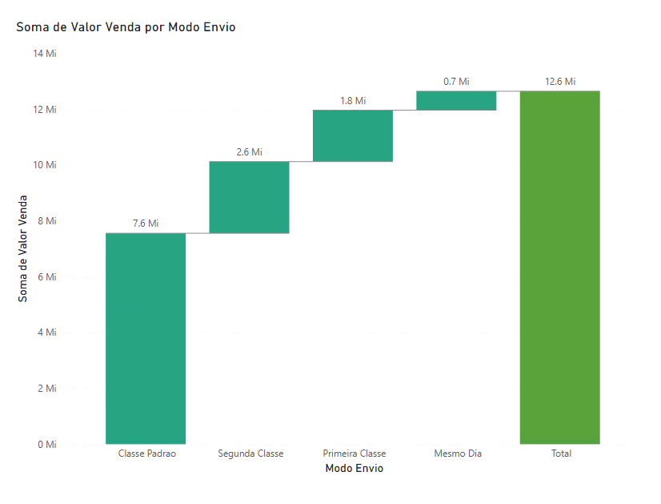
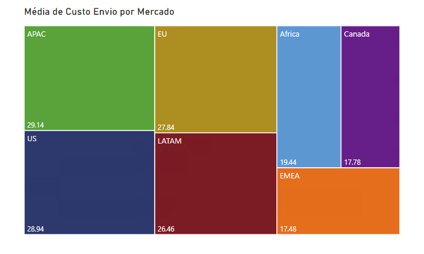
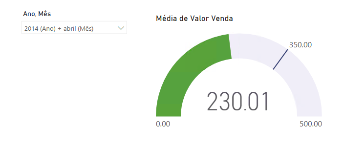
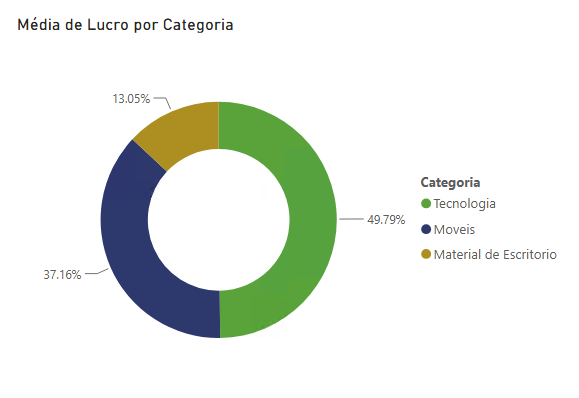

# 📊 Exercícios Power BI Capítulo 02 (Modelagem, Relacionamentos e DAX)

### 1. Qual foi o total de valor venda considerando cada modo de envio dos pedidos? Use um gráfico de cascata.

---

### 2. Quais mercados tiveram o maior custo médio de envio dos produtos vendidos? Use um gráfico treemap.

---

### 3. A empresa tem como objetivo (meta) manter uma média de 350 para o valor de venda  todos os meses. Mostre um indicador (KPI– Key Performance Indicator) com o valor médio de venda. A empresa ficou abaixo ou acima da meta no mês de Abril/2014?

---

### 4. Considere que o lucro é equivalente a: (valor venda - custo envio). Qual categoria de produto apresentou maior lucro médio.

---

### 5. Qual foi o comportamento da margem de lucro ao longo do tempo? Considere a margem de lucro como o lucro dividido pelo valor venda.

---