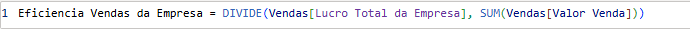
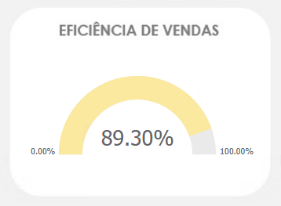
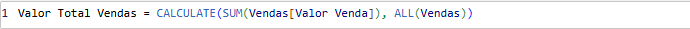
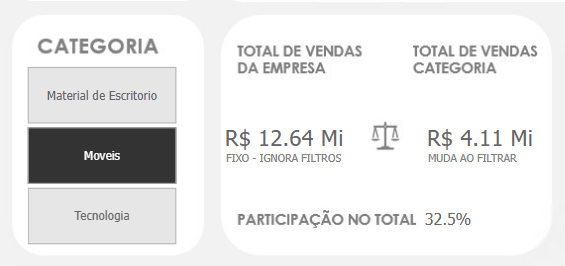
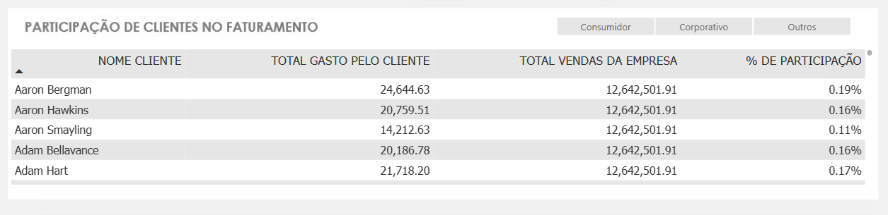

# 📊 Exercícios DAX (Sessão de Aprofundamento — Medida, Contexto de Filtro, CALCULATE)

## Bloco 1 — Lucro e Margem de Lucro

### 1. A diretoria quer saber o lucro gerado por cada venda individual, e depois qual o lucro total da empresa.

#### 🧩 Lucro Por Cada Venda Individual
.png)

#### 🧩 Lucro Total da Empresa:

### 2. A diretoria também quer entender a eficiência de cada venda, não só o valor absoluto do lucro (uma venda de R$10.000 com pouco lucro pode ser pior que uma de R$500 bem mais lucrativa). Mostre isso de alguma forma.

#### 🧩 Cálculo Para Descobrir Eficiência de Vendas (Em %)
 

#### 📊 Gráfico
 

---

## Bloco 2 — CALCULATE (regras de negócio)

## 3. A diretoria quer identificar, para cada categoria de produto, qual percentual do faturamento total da empresa aquela categoria representa, para decidir onde focar investimento e quais categorias têm baixa relevância no negócio. Ou seja: uma coluna mostra o valor de vendas daquela categoria específica, outra coluna mostra o total geral de vendas da empresa (sem se importar com o filtro de categoria), e uma terceira calcula o percentual que uma representa da outra.

#### 🧩 Cálculo Valor Total Vendas da Empresa (FIXO)

#### 🧩 Cálculo Valor Total do Vendas Por Categoria (MUDA AO FILTRAR)
.png)

#### 🧩 Cáculo % Participação Categoria Sobre o Valor Total de Vendas
.png)

#### 📊 Gráfico

### 4. A diretoria quer identificar, para cada cliente, qual percentual do faturamento total da empresa aquele cliente representa, para enxergar rapidamente quem são os clientes mais importantes da carteira. Ou seja: uma coluna mostra o valor de vendas daquele cliente específico, outra coluna mostra o total geral de vendas da empresa (sem se importar com o filtro de cliente), e uma terceira calcula o percentual que um representa do outro.

#### 🧩 Cáculo % Participação Cliente Sobre o Valor Total de Vendas
.png)

#### 📊 Gráfico

### 5. A diretoria quer identificar quais produtos estão vendendo abaixo da média da sua própria categoria. Ou seja, dentro de "Eletrônicos", por exemplo, quais produtos específicos estão performando pior que a média dos outros produtos daquela mesma categoria. Isso ajuda a decidir quais produtos merecem promoção, reposicionamento, ou até descontinuação.

---

## 🧠 Aprendizados

Para saber mais sobre os aprendizados e experiências desta aula consulte o meu README de anotações na sessão do [**Capítulo 3: Aprofundamento em DAX**](../diario_estudos.md).

---
