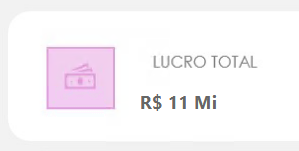

# 📊 Exercícios DAX (Sessão de Aprofundamento — Medida, Contexto de Filtro, CALCULATE)

## Bloco 1 — Lucro e Margem de Lucro

### 1. A diretoria quer saber o lucro gerado por cada venda individual, e depois qual o lucro total da empresa.

#### Lucro Por Cada Venda Individual
.png)

#### Lucro Total da Empresa:

### 2. A diretoria também quer entender a eficiência de cada venda, não só o valor absoluto do lucro (uma venda de R$10.000 com pouco lucro pode ser pior que uma de R$500 bem mais lucrativa). Mostre isso de alguma forma.

---

## Bloco 2 — CALCULATE (regras de negócio)

## 3. A diretoria quer identificar, para cada categoria de produto, qual percentual do faturamento total da empresa aquela categoria representa, para decidir onde focar investimento e quais categorias têm baixa relevância no negócio. Ou seja: uma coluna mostra o valor de vendas daquela categoria específica, outra coluna mostra o total geral de vendas da empresa (sem se importar com o filtro de categoria), e uma terceira calcula o percentual que uma representa da outra.

### 4. A diretoria quer identificar, para cada cliente, qual percentual do faturamento total da empresa aquele cliente representa, para enxergar rapidamente quem são os clientes mais importantes da carteira. Ou seja: uma coluna mostra o valor de vendas daquele cliente específico, outra coluna mostra o total geral de vendas da empresa (sem se importar com o filtro de cliente), e uma terceira calcula o percentual que um representa do outro.

### 5. A diretoria quer identificar quais produtos estão vendendo abaixo da média da sua própria categoria. Ou seja, dentro de "Eletrônicos", por exemplo, quais produtos específicos estão performando pior que a média dos outros produtos daquela mesma categoria. Isso ajuda a decidir quais produtos merecem promoção, reposicionamento, ou até descontinuação.

**Desenvolvimento dos gráficos. Em breve adicionados aqui.**

---
